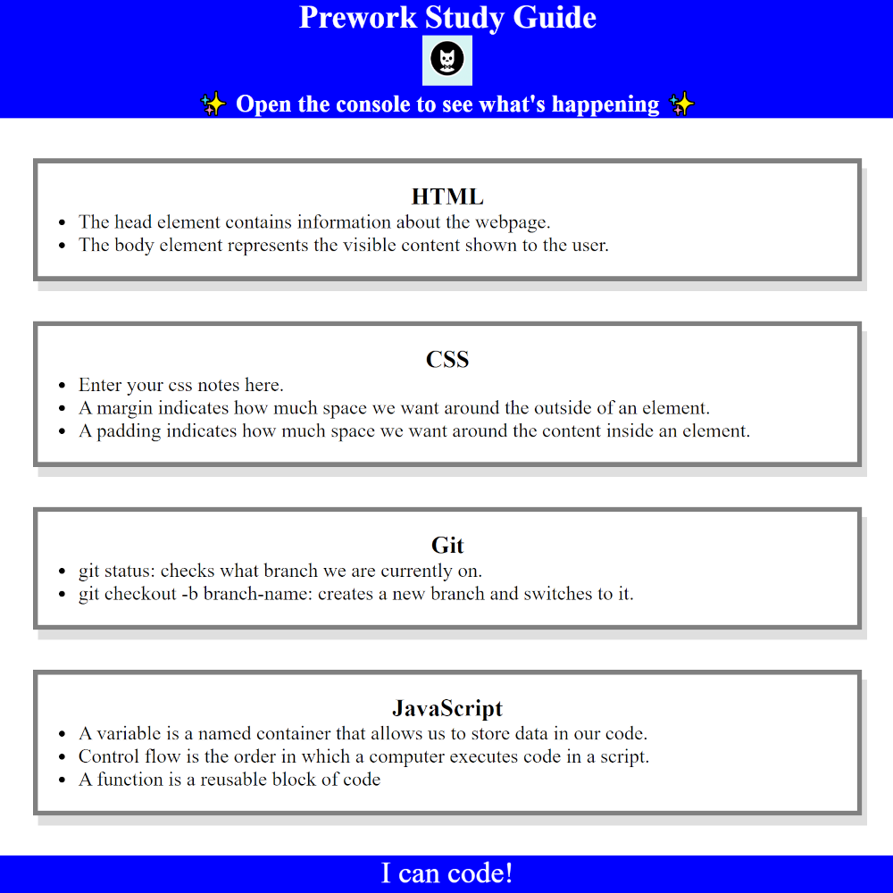

# Pre-Work Study Guide
A UC Berkley Full Stack Web Development Bootcamp Week 0 Challenge

## Description

This study guide's purpose was created in order to have a centralized location for notes on the basics of HTML, CSS, Git, and JavaScript, and to get basic experience in the web development process.

## GitHub Pages

Visit the GitHub pages link to see website: [Pre-Work Study Guide](https://torvec.github.io/m0_prework_study_guide/)

## Visuals

## Usage

This page can be used for studying purposes and has important notes for HTML, CSS, Git, and JavaScript. For JavaScript specifically, you can view the log while using chrome dev tools.

## Credits

- UC Berkley Extension 
- Edward Von Schondorf

## Features

- Study notes on various web development topics

## Project Status

Completed April 2023